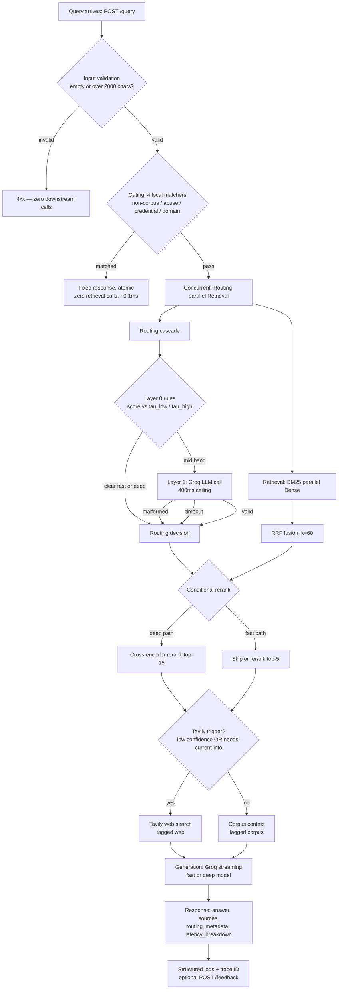

# Hybrid Retrieval & Query Routing System

**A domain-agnostic hybrid retrieval pipeline — BM25 + dense embeddings, RRF fusion, cross-encoder re-ranking, and a two-layer complexity-aware query router. Solo build, free-tier constrained, live-demoable.**

## Table of Contents
- [Overview](#overview)
- [Key Features](#key-features)
- [Architecture](#architecture)
- [Data](#data)
- [Query Routing Logic](#query-routing-logic)
- [Performance](#performance)
- [Tech Stack](#tech-stack)
- [Setup](#setup)
- [Project Structure](#project-structure)
- [Known Limitations](#known-limitations)
- [Extended Capabilities (Phase 7)](#extended-capabilities-phase-7)
- [Requirements Traceability](#requirements-traceability)
- [License](#license)

---

## Overview

Plain RAG retrieves with one signal — usually dense embeddings — and pays the same generation cost on every query regardless of how hard it actually is. This system addresses both problems directly.

**Retrieval** runs BM25 (lexical) and dense embeddings (semantic) concurrently and fuses them with Reciprocal Rank Fusion, so exact terms, IDs, and rare tokens that dense embeddings blur past are still caught, without losing the paraphrase/semantic matches BM25 would miss.

**Routing** classifies each query's complexity *before* generation. Obviously-simple queries go straight to a fast model; obviously-hard queries go straight to a deep model with a full rerank; only the genuinely ambiguous middle costs an extra, tightly-bounded LLM call to decide. Most of the system's cost and latency control comes from this routing layer, not from the retrieval side.

The system is built to be shown to a client live: a rehearsed query set exists for every branch (fast path, deep path, router mid-band, web fallback, every gating category), every stage logs to a common trace ID, and every number in the [Performance](#performance) section below was measured against a running instance, not assumed.

---

## Key Features

- **Dual retrieval, concurrent** — BM25 (`bm25s`, disk-persisted, hot-reloadable via atomic rebuild-and-swap) and dense (Gemini embeddings in Qdrant) run together via `asyncio.gather`, not sequentially.
- **RRF fusion (k=60)** merges both ranked lists without needing score calibration between lexical and semantic scales; a weighted-linear alternative is available behind a config flag.
- **Conditional cross-encoder re-ranking** — the routing decision decides whether and how much to rerank: deep path reranks top-15, fast path skips it or reranks a reduced top-5.
- **Two-layer query router** — free rule-based thresholds handle the obvious cases; a single bounded LLM call (400ms hard ceiling) fires only for the ambiguous middle band, with two deliberately different, explicitly tested failure defaults.
- **Pre-retrieval gating** — four local, LLM-free matchers reject non-corpus / abusive / credential-fishing / out-of-domain queries in ~0.1ms, before a single retrieval call is made.
- **Tavily web fallback** — triggers independently on low fusion confidence or a "needs current info" pattern match; results are tagged `web` vs `corpus` in the response.
- **Shared resilience layer** — one retry/backoff wrapper (max 2 retries on 429/5xx/timeout) reused by every external call: embedding, router LLM, Tavily, generation.
- **Streaming generation with graceful degradation** — deep-path failures fall back to the fast-path model and flag `degraded: true` instead of erroring.
- **Full observability** — every stage logs through one trace-ID-tagged JSON logger; per-stage `latency_breakdown` and `api_call_count` ship in every response.
- **Batch evaluation harness** — Recall@k, MRR, and routing-decision accuracy, plus a rehearsed demo query set that deliberately exercises every branch.
- **Extended capabilities already shipped** — 3-tier routing, a k-NN routing signal, semantic caching, LangSmith tracing, and feedback capture (see [Extended Capabilities](#extended-capabilities-phase-7)).

---

## Architecture

### Build Phases

| Phase | Delivers |
|---|---|
| 1. Environment & Foundational Setup | Project scaffolding, central config, Qdrant via Docker Compose, structured JSON logging |
| 2. Ingestion & Dual Retrieval Core | Chunking, metadata + dedup, dense embedding/Qdrant write, BM25 sparse index (persisted, hot-reload), dense query path, embedding-config consistency check, resilience/retry layer, concurrent sparse+dense retrieval, RRF fusion math |
| 3. Query Gating & Routing Layer | Pre-retrieval gating (4 local matchers), composite complexity score, two-layer routing cascade, routing‖retrieval concurrency |
| 4. Fusion, Reranking & Fallbacks | Cross-encoder reranker, conditional rerank wiring (completes RRF fusion), Tavily fallback leg |
| 5. Generation, API, Streaming & Observability | Full pipeline wiring, streaming generation with degraded-mode fallback, FastAPI surface (`/query`, `/health`), consolidated observability logging |
| 6. Evaluation & Hardening | Batch evaluation harness, curated demo corpus + rehearsed query set, DoD-gate validation pass + scalability-boundary docs |
| 7. Extended Capabilities | Weighted-linear fusion alt, 3-tier routing, LangSmith tracing, feedback capture, k-NN routing signal, semantic caching |

### Runtime Request Flow



### Ingestion Flow

```
Document (PDF / TXT / Markdown)
  → chunking (200–500 tok, 10–15% overlap)
  → metadata tagging + SHA-256 content-hash dedup
  ├─ dense embed (Gemini, task_type=document) → Qdrant upsert
  └─ tokenize → bm25s index (disk-persisted, atomic rebuild + swap)
```

---

## Data

The pipeline is **domain-agnostic** — it ingests whatever document set the deploying team points it at (technical docs, policies, catalogs, whatever), not a fixed corpus.

**Ingestion**
- Accepted formats: PDF, TXT, Markdown
- Chunking: token-based splitter, 200–500 tokens per chunk, 10–15% overlap (FR-1), bounds configurable via `Settings`
- Metadata attached per chunk: source doc ID, chunk index, character offset range, ingestion timestamp (FR-2)
- Deduplication: SHA-256 hash over normalized chunk text, checked against a persisted hash set before a chunk is accepted for storage — re-ingesting the same file does not grow the chunk count (FR-3)

**Storage — dual index, kept in sync**
- Dense: embedded via Gemini (`task_type=document`) and upserted into Qdrant with the chunk's metadata as payload
- Sparse: tokenized and built into a `bm25s` index, persisted to disk; a tokenization cache means a rebuild only re-tokenizes *new* chunks (see [Known Limitations](#known-limitations) for what "incremental" does and doesn't mean here)

**Demo corpus**
A separate, larger, curated corpus (`data/corpus/`) built specifically for live walkthroughs — sized to fit comfortably within BM25's in-memory constraint, paired with a rehearsed query set (`tests/fixtures/demo_queries.jsonl`) with a concrete case for every major branch: fast path, deep path, router mid-band, Tavily trigger, and each gating category.

---

## Query Routing Logic

Routing runs as a **two-layer cascade**, concurrently with retrieval — not after it.

**Layer 0 — rule-based thresholds (free, no LLM call)**

A composite complexity score is computed per query from four features — normalized token count, comparison/multi-hop trigger-term presence, question-word category, and clause count:

```
score = 0.20 · token_count_feat
      + 0.35 · keyword_feat
      + 0.25 · question_word_feat
      + 0.20 · clause_count_feat
```

- `score < tau_low (0.3)` → **fast path**, decided immediately
- `score > tau_high (0.6)` → **deep path**, decided immediately
- otherwise → falls through to Layer 1

**Layer 1 — LLM fallback (only for the mid-band)**

A single Groq `llama-3.1-8b-instant` call at temperature 0 returns `{path, confidence, reason}`, validated against a Pydantic schema, wrapped in a hard `asyncio.wait_for(..., timeout=400ms)`. Retry/backoff (max 2, on 429/5xx/timeout) runs *inside* that same 400ms window, not on top of it — a retry that would blow past the ceiling doesn't get to; the outer timeout still cancels at 400ms.

Two distinct failure defaults, deliberately different, both explicitly tested:

| Failure mode | Default | Why |
|---|---|---|
| Call returns but fails schema validation | **Fast path**, `degraded: true` | FR-13 / NFR-9 |
| Call exceeds the 400ms ceiling (with or without exhausting retries) | **Deep path** | Bias toward the safer/deeper answer under routing uncertainty |

Each branch logs a distinct `deciding_layer` (`"malformed-fallback"` vs `"timeout-fallback"`) so the failure mode is unambiguous in the logs.

**Extended (Phase 7):** a third tier (mid, between fast and deep) is added via a second threshold on the same continuous score — a threshold change, not a redesign — and a k-NN Layer 2 signal exists but only merges into the live cascade if it measurably beats the Layer 0/1-alone baseline on routing accuracy.

---

## Performance

Benchmarked against a running instance — not projected:

| Metric | Value | Source |
|---|---|---|
| Fast-path query, end-to-end | **~3s** | Benchmarked |
| Deep-path query, end-to-end | **~5s** | Benchmarked |
| Query gating | **~0.1ms** | Benchmarked |
| Gating latency ceiling | <50ms p95 | NFR-13 (DoD gate) |
| LLM-router call, p95 target | 350ms | NFR-1 |
| Router timeout, configured | 400ms | Settings — see note below |
| Query-embedding call, p95 target | 400ms | NFR-1 |
| Retrieval stage, p95 target | 60ms | NFR-1 |
| Recall@10 | ≥0.85 | NFR-5 (DoD gate) |
| Routing accuracy vs. baseline | ≥80% | NFR-6 (DoD gate) |
| API calls per query, max | ≤4 | NFR-4 (DoD gate) |
| Retry budget | 2 retries on 429/5xx/timeout | NFR-8 (DoD gate) |

**On the 400ms router ceiling:** NFR-1's stated p95 target for that specific call is 350ms, not 400ms. 400ms is used anyway — it sits above the documented p95 rather than at it (a ceiling set exactly at a stated p95 would, by construction, still cut off ~5% of in-spec calls), and it's independently consistent with the rest of the pre-generation budget: embedding (400ms p95) + retrieval (60ms p95) puts fusion-readiness at roughly 460ms p95, so a 400ms router ceiling keeps Layer 1 comfortably off the critical path.

**Note:** the NFR-1 figures above cover query embedding, retrieval, and routing only — the pre-generation stages. They are not the same measurement as the ~3s / ~5s end-to-end numbers, which include LLM generation, the larger share of total time in both paths.

---

## Tech Stack

| Layer | Technology | Role |
|---|---|---|
| Vector store | Qdrant (self-hosted, Docker Compose) | Dense vector storage + cosine search |
| Sparse index | `bm25s` | Disk-persisted BM25 lexical search, hot-reloadable |
| Dense embeddings | Gemini `gemini-embedding-001` | Document + query embeddings (model/version/task_type/dimension pinned in one place) |
| Re-ranking | `sentence-transformers` cross-encoder (`ms-marco-MiniLM-L-6` class) | Local, no external call |
| Fast / router LLM | Groq `llama-3.1-8b-instant` | Layer-1 routing decision, fast-path generation |
| Deep / mid LLM | Groq `llama-3.3-70b-versatile`, `gpt-oss-20b`, `gpt-oss-120b` | Deep-path and 3-tier generation |
| Web fallback | Tavily | Live web search when corpus confidence is low or the query needs current info |
| API layer | FastAPI + Uvicorn | `/query`, `/health`, `/feedback` |
| Config | Pydantic + `pydantic-settings` | Fully externalized, no hardcoded tunables (FR-19) |
| Trace / feedback store | SQLite (functional wrapper, no ORM) | Feedback capture keyed by trace ID (FR-32) |
| Tracing | LangSmith (`@traceable`) | Per-stage spans (Phase 7) |
| Package management | `uv` | Dependency management, task running |
| Containerization | Docker Compose | Qdrant service orchestration |
| Testing | pytest, pytest-asyncio | Unit, integration, and fault-injection tests |

---

## Setup

**Prerequisites:** Docker + Docker Compose, `uv`, Python 3.11+, free-tier API keys for Groq, Google AI Studio (Gemini), and Tavily.

```bash
# 1. Install dependencies and verify the environment
uv sync
uv run python -c "import qdrant_client, bm25s, sentence_transformers, groq, google.genai, tavily, fastapi, pydantic_settings"

# 2. Configure environment variables
cp .env.example .env
# fill in GROQ_API_KEY, GOOGLE_API_KEY, TAVILY_API_KEY, etc.

# 3. Start Qdrant
docker compose up -d qdrant

# 4. Ingest a document
uv run python -m src.ingestion.pipeline --path path/to/your/doc.pdf

# 5. Build the BM25 index
uv run python -m src.retrieval.sparse_bm25 --build

# 6. Run the API
uv run uvicorn src.api.main:app

# 7. Query it
curl -s -X POST localhost:8000/query -d '{"query":"your question here"}' | python -m json.tool
curl -s localhost:8000/health | python -m json.tool

# 8. Run batch evaluation
uv run python -m src.eval.run_eval --set tests/fixtures/eval_set.jsonl

# 9. Validate all DoD gates end-to-end
bash scripts/validate_dod.sh
```

> Note: a trailing whitespace character in a `.env` value breaks the Docker Compose env-file parser silently — worth double-checking if a container fails to pick up a variable.

---

## Project Structure

```
.
├── config/
│   └── settings.py
├── src/
│   ├── ingestion/
│   │   ├── loaders.py
│   │   ├── chunking.py
│   │   ├── pipeline.py
│   │   └── embedder.py
│   ├── retrieval/
│   │   ├── sparse_bm25.py
│   │   ├── dense_qdrant.py
│   │   ├── fusion.py
│   │   ├── rerank.py
│   │   ├── fallback.py
│   │   ├── tavily_fallback.py
│   │   ├── orchestrator.py
│   │   └── cache.py            # Phase 7
│   ├── routing/
│   │   ├── features.py
│   │   ├── layer0_rules.py
│   │   ├── layer1_llm.py
│   │   └── layer2_knn.py       # Phase 7
│   ├── gating/
│   │   └── prefilter.py
│   ├── generation/
│   │   └── groq_stream.py
│   ├── api/
│   │   ├── main.py
│   │   ├── schemas.py
│   │   └── feedback.py         # Phase 7
│   ├── observability/
│   │   ├── logging_setup.py
│   │   └── tracing.py          # Phase 7
│   ├── eval/
│   │   ├── metrics.py
│   │   └── run_eval.py
│   ├── pipeline/
│   │   └── run_query.py
│   └── common/
│       ├── qdrant_client.py
│       ├── config_check.py
│       ├── resilience.py
│       └── trace_store.py      # Phase 7
├── data/
│   └── corpus/
├── tests/
│   ├── fixtures/
│   │   ├── eval_set.jsonl
│   │   └── demo_queries.jsonl
│   └── test_*.py
├── docs/
│   └── SCALABILITY_BOUNDARY.md
├── scripts/
│   └── validate_dod.sh
├── docker-compose.yml
├── .env.example
└── pyproject.toml
```

---

## Known Limitations

Stated plainly, not softened:

- **BM25 has no true incremental update.** `bm25s` has no single-document incremental-index API — IDF and average-document-length are corpus-wide statistics, so `rebuild_and_swap()` recomputes the full statistical fit on *every* rebuild. What's actually incremental is the tokenization cost (via a `chunk_id → tokens` cache), not the index-mutation algorithm itself.
- **Single-node Qdrant.** No HA, no replication. This is a deliberate scope boundary for a solo, free-tier-constrained build, documented explicitly in `docs/SCALABILITY_BOUNDARY.md` rather than left for a client to discover after deployment.
- **BM25's in-memory footprint is a real ceiling.** The demo corpus is sized to fit comfortably within it — this is not an unbounded-scale system as shipped.
- **The real concurrency ceiling today is free-tier rate limits** (Groq / Gemini / Tavily), not the architecture. The architecture is designed to scale further on paid infrastructure — it does not do so today.
- **The k-NN routing signal (Layer 2, FR-28) may correctly ship unmerged.** It's built and measured, but only joins the live routing cascade if it beats the Layer 0/1-alone baseline on accuracy (NFR-6). "Built, measured, and not merged" is a valid, intended outcome, not a bug.
- **Semantic caching (FR-30) ships disabled by default.** It stays off until the embedding-config consistency check has a clean logged run — enabling it earlier is unsupported and untested.

---

## Extended Capabilities (Phase 7)

Everything below is **already built and validated against a DoD-gated v1 core** — finalized scope, not a roadmap wishlist:

- **3-tier routing (FR-27)** — a second threshold on the existing complexity score adds a mid tier between fast and deep.
- **k-NN routing signal (FR-28)** — a Layer 2 signal using the already-computed query embedding (no extra embedding call), bootstrapped from accumulated routing logs; conditionally merged only if it improves accuracy.
- **Weighted-linear fusion (FR-29)** — an alternative to RRF, selectable via a `fusion_strategy` config flag; RRF stays the default.
- **Semantic caching (FR-30)** — embedding-similarity-threshold caching for retrieval + generation, gated behind verified embedding-config stability.
- **LangSmith tracing (FR-31)** — per-stage spans matching the same field set as the structured logs.
- **Feedback capture (FR-32)** — `POST /feedback`, backed by a small SQLite trace store keyed by trace ID.

---

## Requirements Traceability

Every functional and non-functional requirement maps to the step(s) that built and verified it:

| ID | What it covers | Step(s) |
|---|---|---|
| FR-1 | Chunking: 200–500 tok, 10–15% overlap | 5, 6 |
| FR-2 | Chunk metadata | 6 |
| FR-3 | Content-hash dedup | 6 |
| FR-4 | BM25 top-N | 8 |
| FR-5 | Dense top-N (cosine) | 7, 9 |
| FR-6 | RRF fusion + conditional rerank | 13, 19 |
| FR-7 | Concurrent sparse ∥ dense | 12 |
| FR-8 | Embedding-failure → sparse-only fallback | 11 |
| FR-9 | Tavily fallback leg | 20 |
| FR-10 | Cross-encoder reranker | 18 |
| FR-11 | Composite complexity score | 15 |
| FR-12 | Threshold routing (τ_low/τ_high) | 16 |
| FR-13 | LLM-router fallback | 16 |
| FR-14 | Routing ∥ retrieval concurrency | 17 |
| FR-15 | `POST /query` contract | 23 |
| FR-16 | `GET /health` | 23 |
| FR-17 | Input validation (empty/oversized) | 23 |
| FR-18 | Batch eval entrypoint | 25 |
| FR-19 | Externalized config | 2 (foundation, enforced by every later step) |
| FR-20 | Per-query structured logging | 4 (foundation), 24 (consolidated & verified) |
| FR-21 | Non-corpus-intent gate | 14 |
| FR-22 | Abusive-language gate | 14 |
| FR-23 | Credential-solicitation gate | 14 |
| FR-24 | Domain-relevance gate | 14 |
| FR-25 | Local-only gating (no LLM call) | 14 |
| FR-26 | Token-by-token streaming | 22 |
| FR-27 | 3-tier routing (fast/mid/deep) | 29 |
| FR-28 | k-NN routing signal | 32 |
| FR-29 | Weighted-linear fusion alternative | 28 |
| FR-30 | Semantic caching | 33 |
| FR-31 | LangSmith tracing | 30 |
| FR-32 | Feedback capture | 31 |
| NFR-2 | End-to-end latency (DoD gate) | 27 (validated); depends on 12, 17, 22 |
| NFR-4 | ≤4 API calls/query (DoD gate) | 24 (tracked), 27 (validated) |
| NFR-5 | Recall@10 ≥ 0.85 (DoD gate) | 25 (measured), 27 (validated) |
| NFR-6 | Routing accuracy ≥ 80% (DoD gate) | 25 (measured), 27 (validated) |
| NFR-8 | Retry/backoff (DoD gate) | 11 (built); reused by 16, 20, 22 |
| NFR-9 | Degraded-mode fallback (DoD gate) | 11 (embedding half), 16 (router half), 22 (generation half) |
| NFR-11 | Observability fields (DoD gate) | 24 |
| NFR-12 | Scalability boundary documented (DoD gate) | 27 |
| NFR-13 | Gating latency <50ms (DoD gate) | 14 |

Step 27 is the "v1 done" line — everything before it is the DoD-gated core; everything in Phase 7 is additive on top of a system already measured, not assumed, to meet spec.

---

## License

**Author:** Sameer — Gujrat, Pakistan
**License:** _baad main_